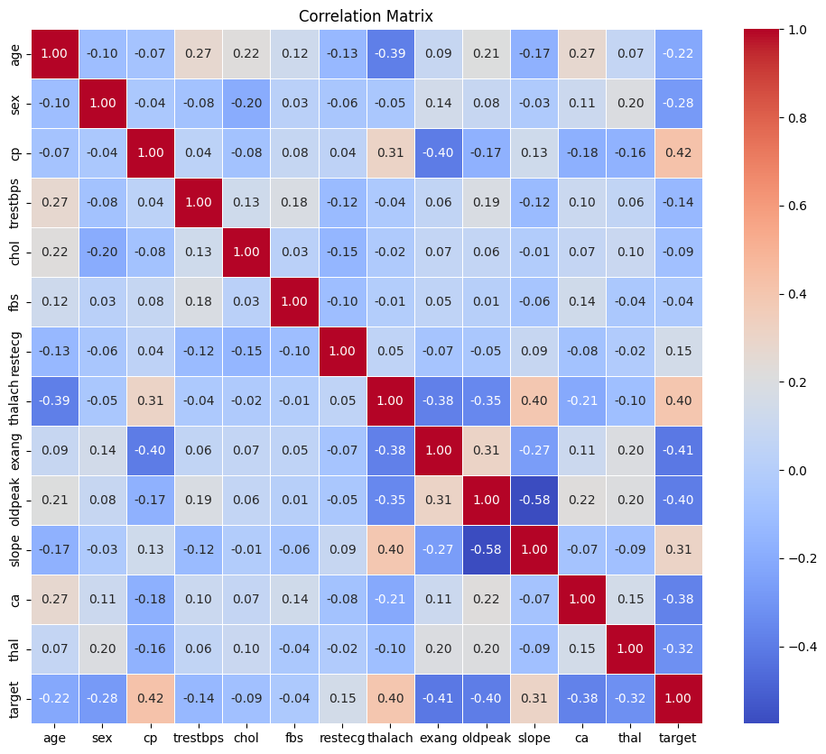
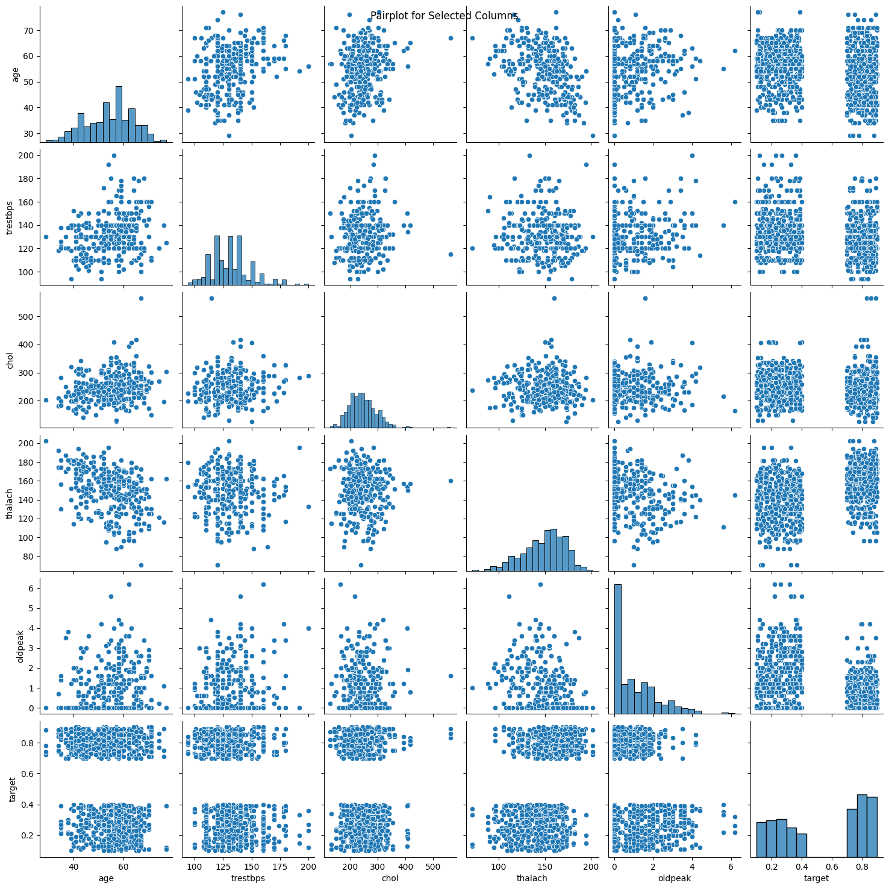
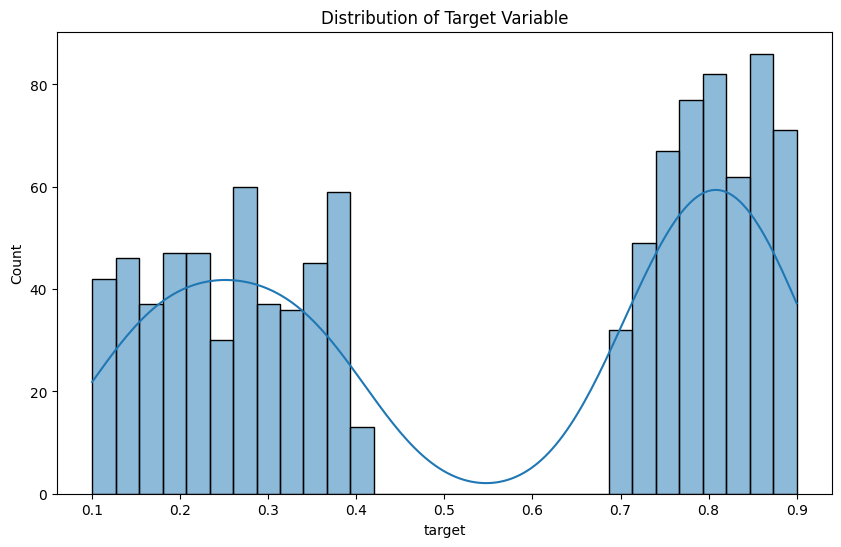
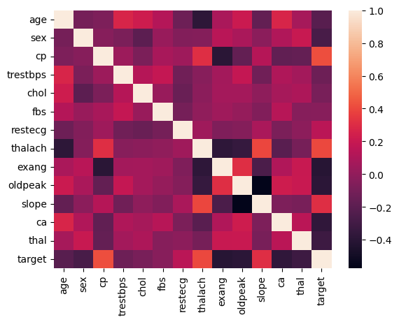
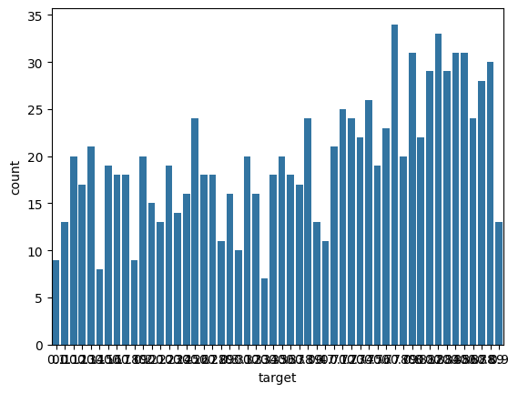
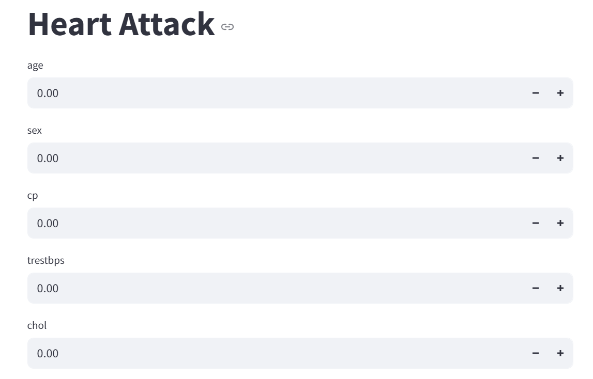

# Laporan Proyek Machine Learning
### Nama :  M Fajar Zamzami
### Nim : 211351077
### Kelas : Pagi C

## Domain Proyek
Heart attack menjadi salah satu penyakit yang mematikan di dunia, termasuk di Indonesia. Heart attack dapat menyebabkan komplikasi di banyak bagian tubuh dan secara keseluruhan dapat meningkatkan risiko kematian. Salah satu cara untuk mendeteksi penyakit heart attack adalah dengan memanfaatkan algoritma machine learning.

## Business Understanding

### Problem Statements

Ketidakmungkinan bagi seseorang untuk memprediksi Heart attack (serangan jantung)

### Goals
mencari solusi untuk menganalisis penyakit diabetes yang diderita.

### Solution statements
Pengembangan Platform Heart attack Berbasis Web, Solusi pertama adalah mengembangkan platform pengechekan heart attack(serangan jantung) yang mengintegrasikan data dari Kaggle.com untuk memberikan pengguna akses mudah untuk menganalisis.

## Data Understanding
Dataset yang saya gunakan berasal dari Kaggle.<br> 

[Heart Attack Prediction](https://www.kaggle.com/datasets/juledz/heart-attack-prediction).

### Variabel-variabel pada Heart Attack adalah sebagai berikut:
Age : merepresentasikan usia pasien dalam bentuk numerik (misalnya, 52 tahun).

Sex : merepresentasikan jenis kelamin pasien, dengan nilai 0 untuk perempuan dan 1 untuk laki-laki.

Chest Pain Type : merepresentasikan jenis nyeri dada yang dialami pasien. Nilai 0 menunjukkan nyeri angina tipikal, 1 untuk angina atipikal, 2 untuk nyeri non-anginal, dan 3 untuk tanpa gejala (asimptomatik).

Resting Blood Pressure : menunjukkan tekanan darah pasien saat istirahat dalam satuan mmHg (misalnya, 125 mmHg), yang berguna untuk mengetahui tekanan kerja jantung saat tidak melakukan aktivitas.

Serum Cholesterol : menunjukkan kadar kolesterol total dalam darah pasien dalam satuan mg/dL (misalnya, 212 mg/dL), yang dapat memengaruhi risiko penyakit jantung.

Fasting Blood Sugar : merepresentasikan kadar gula darah puasa pasien. Nilai 0 menunjukkan kadar gula darah kurang dari atau sama dengan 120 mg/dL, sedangkan nilai 1 menunjukkan kadar lebih dari 120 mg/dL.

Resting Electrocardiographic Results : menunjukkan hasil pemeriksaan EKG saat istirahat. Nilai 0 menunjukkan hasil normal, 1 menunjukkan adanya kelainan gelombang ST-T, dan 2 menunjukkan kemungkinan adanya hipertrofi ventrikel kiri.

Maximum Heart Rate Achieved : menunjukkan detak jantung maksimum yang dicapai pasien selama uji stres, dalam satuan denyut per menit (misalnya, 168 bpm).

Exercise-Induced Angina : menunjukkan apakah pasien mengalami angina (nyeri dada) akibat latihan fisik. Nilai 0 berarti tidak, dan nilai 1 berarti ya.

Oldpeak (ST Depression) : menunjukkan tingkat depresi segmen ST dibandingkan dengan kondisi istirahat, biasanya diukur dalam mm (misalnya, 1.0), yang dapat menunjukkan iskemia miokard.

Slope of Peak Exercise ST Segment : menunjukkan kemiringan segmen ST saat latihan. Nilai 0 menunjukkan kemiringan naik (upsloping), 1 datar (flat), dan 2 menurun (downsloping).

Number of Major Vessels Colored by Fluoroscopy : menunjukkan jumlah pembuluh darah utama (0–3) yang terlihat melalui pewarnaan menggunakan fluoroskopi selama pemeriksaan jantung.

Thalassemia : merepresentasikan jenis kelainan darah pada pasien. Nilai 1 menunjukkan kondisi normal, 2 untuk defek tetap (fixed defect), 3 untuk defek reversibel (reversible defect), dan 0 untuk data yang hilang.

## Data preparation
Untuk data collection ini, saya mendapatkan dataset yang nantinya digunakan dari website kaggle dengan nama dataset Heart Attack Prediction with Logistic Regression, jika anda tertarik dengan datasetnya, anda bisa click link diatas.

### Data Discovery And Profiling
Untuk bagian ini, kita akan menggunakan teknik EDA. <br>
Pertama kita mengimport semua library yang dibutuhkan

```bash
from google.colab import files
files.upload()
```

```bash
!mkdir -p ~/.kaggle
!cp kaggle.json ~/.kaggle/
!chmod 600 ~/.kaggle/kaggle.json
!ls ~/.kaggle
```

```bash
!kaggle datasets download -d juledz/heart-attack-prediction
```

```bash
!mkdir heart-dataset
!unzip heart-attack-prediction.zip -d heart
!ls heart
```

```bash
import matplotlib.pyplot as plt
import seaborn as sns
import tensorflow as tf
from sklearn.model_selection import train_test_split
from sklearn.preprocessing import StandardScaler
from sklearn.metrics import mean_squared_error, r2_score
import numpy as np
import pandas as pd
```

```bash
df = pd.read_csv(r'/content/heart/heart.csv')
```

```bash
df.head()
```

```bash
df.describe()
```

```bash
df.info()
```

# EDA

```bash
correlation_matrix = df.corr()
plt.figure(figsize=(12, 10))
sns.heatmap(correlation_matrix, annot=True, cmap='coolwarm', fmt=".2f", linewidths=0.5)
plt.title('Correlation Matrix')
plt.show()
```


```bash
sns.pairplot(df[['age', 'trestbps', 'chol', 'thalach', 'oldpeak', 'target']])
plt.suptitle('Pairplot for Selected Columns')
plt.show()
```


```bash
plt.figure(figsize=(10, 6))
sns.histplot(df['target'], bins=30, kde=True)
plt.title('Distribution of Target Variable')
plt.show()
```


```bash
sns.heatmap(df.corr())
```


```bash
sns.countplot(x='target',data=df)
```


```bash
X = df.drop('target', axis=1)
y = df['target']
X_train, X_test, y_train, y_test = train_test_split(X, y, test_size=0.2, random_state=42)
scaler = StandardScaler()
X_train_scaled = scaler.fit_transform(X_train)
X_test_scaled = scaler.transform(X_test)
```

# Modelling

```bash
model = tf.keras.Sequential([
    tf.keras.layers.Dense(64, activation='relu', input_shape=(X_train_scaled.shape[1],)),
    tf.keras.layers.Dense(32, activation='relu'),
    tf.keras.layers.Dense(1)
```

```bash
model.summary()
```

```bash
model.compile(optimizer='adam', loss='mean_squared_error')
history = model.fit(X_train_scaled, y_train, epochs=50, batch_size=32, validation_split=0.2, verbose=2)
```

```bash
y_pred = model.predict(X_test_scaled).flatten()


mse = mean_squared_error(y_test, y_pred)
r2 = r2_score(y_test, y_pred)

print(f'Mean Squared Error: {mse}')
print(f'R-squared: {r2}')
```

```bash
plt.plot(history.history['loss'], label='Training Loss')
plt.plot(history.history['val_loss'], label='Testing Loss')
plt.title('Loss Function Over Epochs')
plt.xlabel('Epochs')
plt.ylabel('Loss')
plt.legend()
plt.show()
```

# EVALUATION

```bash
new_data = pd.DataFrame(data=[[45, 7, 3, 120, 200, 0, 1, 160, 0, 1.5, 2, 0, 3]], columns=X.columns)

new_data_scaled = scaler.transform(new_data)

predicted_risk = model.predict(new_data_scaled).flatten()[0]


predicted_risk_percentage = round(predicted_risk * 100, 2)
print(f'Predicted Risk of Heart Disease: {predicted_risk_percentage}%')
```


```bash
lr = LinearRegression()
lr.fit(X_train,y_train)
```

```bash
from sklearn.model_selection import train_test_split
from sklearn.linear_model import LinearRegression
import pickle

filename = "heart.sav"
pickle.dump(lr,open(filename,'wb'))
```
## Deployment

[My Estimation App](https://heartattack-neyd7subjkkivjfovmwriq.streamlit.app/).


